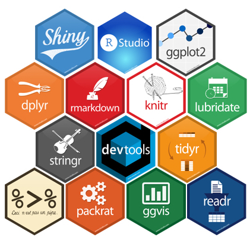

```{r setup, include=FALSE}

knitr::opts_chunk$set(echo = TRUE, fig.align = "center")
```

# Sobre a oficina de introdução ao R

- Oficina introdutória

- Oferecida pelo LAPLAN e [MACROAMB](http://govamb.iee.usp.br/). 

- 2a Edição (a primeira aconteceu em outubro no IEE)

- A oficina tem como objetivo introduzir os pesquisadores sobre as possibilidades de utilização do software R como ferramenta para manipulação e análise de dados em pesquisas e projetos científicos. 

- Cooperar para a difusão de **ferramentas gratuitas** e colaborativas na elaboração de pesquisas e produção de conhecimento científico.

---
# Instrutora

* **Beatriz Milz**
  - Bacharel em Gestão Ambiental (EACH/USP).
  - Mestre em Ciências no PPG-Análise Ambiental Integrada (UNIFESP/Diadema).
  - Atualmente no processo seletivo de Doutorado em Ciência Ambiental no PROCAM/IEE/USP.
  - Co-organizadora do Meetup [R-Ladies São Paulo](https://www.meetup.com/R-Ladies-Sao-Paulo/).
  - Email:<a href="mailto:beatriz.milz@hotmail.com"><i class="fas fa-envelope-square"></i>&nbsp; beatriz.milz@hotmail.com</a><br>
  - Github:<a href="http://github.com/beatrizmilz"><i class="fab fa-github"></i>&nbsp; @beatrizmilz</a> (repositório de código)<br>

---
# Organizadora e Monitora

* **Rosana Laura da Silva **
  - Mestranda em Planejamento e Gestão do Território - UFABC
  - Bacharel em Ciência e Tecnologia - UFABC
  - Bacharel em Engenharia Ambiental e Urbana - UFABC
  - LAPLAN - Laboratório de Planejamento e Gestão do Território
  - MACROAMB - Projeto Temático FAPESP: Governança Ambiental da Macrometrópole Paulista faca à variabilidade climática.
    - Email:<a href="mailto:laura.ufabc@gmail.com"><i class="fas fa-envelope-square"></i>&nbsp;laura.ufabc@gmail.com</a><br>
    
---
# Organizadora e Monitora

* **Bruna de Souza Fernandes**
  - Cursando Bacharel em Ciência e Humanidades - UFABC
  - Cursando Bacharel em Planejamento Territorial - UFABC
  - LAPLAN - Laboratório de Planejamento e Gestão do Território
  - MACROAMB - Projeto Temático FAPESP: Governança Ambiental da Macrometrópole Paulista faca à variabilidade climática.
  - Email:<a href="mailto:bsfernandes17@gmail.com"><i class="fas fa-envelope-square"></i>&nbsp;bsfernandes17@gmail.com</a><br>
  
---
# Monitora

* **Alissa Munerato**
  - Co-organizadora do Meetup [R-Ladies São Paulo](https://www.meetup.com/R-Ladies-Sao-Paulo/).
  - Cursando Bacharelado em Ciência e Tecnologia - UFABC
  - Cursando Bacharelado em Neurociência - UFABC
  - Email:<a href="mailto:alissamunerato@gmail.com"><i class="fas fa-envelope-square"></i>&nbsp; alissamunerato@gmail.com</a><br>


---
class: center, middle
# Introdução
---


## O que é o R?

> R is a free software environment for statistical computing and graphics. (https://www.r-project.org/)

> R é um ambiente de software livre para computação estatística e gráficos.


* O R é open-source;

* Muito usado por cientistas de dados, estatísticos e pesquisadores.


```{r echo=FALSE, out.width="40%"}
knitr::include_graphics("imagens/Rlogo.png")
```
---

## Ciclo da ciência de dados

```{r echo=FALSE, out.width="100%"}
knitr::include_graphics("imagens/data-science.png")
```

Fonte: [Livro R for Data Science](http://r4ds.had.co.nz/)
---
## O R é uma linguagem de programação.

Qual é a vantagem?
* É um texto

* É reprodutível 

* Dá para compartilhar!
---
## Reproducible Research / Ciência Reprodutível
> *"The goal of reproducible research is to tie specific instructions to data analysis and experimental data so that scholarship can be recreated, better understood and verified."*

> *"O objetivo da pesquisa reprodutível é vincular instruções específicas à análise de dados e dados experimentais para que os estudos possam ser recriados, melhor compreendidos e verificados."*

Fonte: [CRAN Task View: Reproducible Research](https://cran.r-project.org/view=ReproducibleResearch)

---
## O que podemos fazer com o R?

* Análise de dados - Estatística, modelagem, etc.

* Visualização de dados

* Apresentações - Pacote Xaringan - [Material: Comunicando seus resultados e criando apresentações com R](https://beatrizmilz.github.io/apresentacao_RLadies_xaringan)

* Relatórios dinâmicos

* Escrever livros - [Pacote Bookdown](https://bookdown.org/)

* Mineração de dados

* Muito mais ...
---

**Exemplo: Gráfico elaborado com R - Proposta Orçamentária PMSP 2019 - 10 maiores orçamentos** 

```{r echo=FALSE, out.width="90%"}
knitr::include_graphics("https://beatrizmilz.github.io/DadosExecucaoOrcamentariaPMSP/proposta2019_files/figure-html/unnamed-chunk-5-1.png") 
```
Fonte: [Explorando o orçamento da Prefeitura Municipal de São Paulo](https://beatrizmilz.github.io/DadosExecucaoOrcamentariaPMSP/proposta2019.html)


---

**Exemplo: Gráfico elaborado com R - Execução Orçamentária PMSP na função Gestão Ambiental** 

```{r echo=FALSE, out.width="90%"}
knitr::include_graphics("https://beatrizmilz.github.io/DadosExecucaoOrcamentariaPMSP/gestaoambiental_files/figure-html/unnamed-chunk-5-1.png") 
```
Fonte: [Explorando o orçamento da Prefeitura Municipal de São Paulo](https://beatrizmilz.github.io/DadosExecucaoOrcamentariaPMSP/gestaoambiental.html)


---

**Exemplo: Gráfico elaborado com R - Material Particulado 10 - Dados CETESB - RPollution;** 

```{r echo=FALSE, out.width="90%"}
knitr::include_graphics("https://www.rpollution.com/blog/pm-em-sp_files/figure-html/unnamed-chunk-6-1.png") 
```
Fonte: [Rpollution](https://www.rpollution.com/)

---

**Exemplo: Frequencia de Palavras - TESE Doutorado PROCAM/USP Ana Lucia Spinola;** 

```{r echo=FALSE, out.width="90%"}
 
```
Fonte: [Ana Lu Spinola](https://analuspi.github.io/Text-Mining/)
---

**Exemplo: BIGRAM - TESE Doutorado PROCAM/USP Ana Lucia Spinola;** 

```{r echo=FALSE, out.width="90%"}
knitr::include_graphics("imagens/bigram-ana-lu.png") 
```
Fonte: [Ana Lu Spinola](https://analuspi.github.io/Text-Mining/)


---
**Exemplo: Nuvem de palavras**

```{r message=FALSE, warning=FALSE, include=FALSE, paged.print=FALSE}
library(data.table)
library(bit64)
library(magrittr)
library(tm)
library(wordcloud)
library(wordcloud2)
library(tidyverse)

```

```{r message=FALSE, warning=FALSE, include=FALSE}
dados<- fread('dados/export_scielo_ambienteesociedade.csv', encoding="UTF-8") 
  names(dados) <- c('id', 'title', 'authors', 'source', 'journal', 'language', 'publicationyear','url') 
```

```{r message=FALSE, warning=FALSE, include=FALSE}
 dados <- dados %>% 
as.data.frame(., stringsAsFactors=F) %>% .[-2,]
#View(dados)

pal2 = brewer.pal(8,'Dark2')

dadosinglesword <- dados[,2] %>% tolower %>% 
  removePunctuation %>% removeWords(., stopwords('pt')) %>% 
    removeWords(., stopwords('en')) %>%   removeWords(., stopwords('es')) %>%  removeWords(c("errata", "editorial", "apresentação", "sobre"))
#View(dadosinglesword)
```


```{r message=FALSE, warning=FALSE, include=FALSE}
corpus <- Corpus(VectorSource(enc2native(dadosinglesword)))
#corpus
#preparando o df para wordcloud2
tdm.word <- TermDocumentMatrix(corpus) %>% as.matrix
#tdm.word 
tdm.df <- data.frame(words = rownames(tdm.word),
                    freq = apply(tdm.word,1,sum)) %>% filter(freq>7)

```
<center>
```{r echo=FALSE, fig.align='center'}
wordcloud2(tdm.df, size=.5)
```
</center>


---
# Exemplo de dashboard

- Polling Data - http://pollingdata.com.br/ - pesquisas eleitorais
- Dashboard em Shiny - R

---

## RStudio

**RStudio** é o IDE da Linguagem R, ou seja, o ambiente que utilizamos para editar e executar os códigos em R.

* Facilita a utilização do R.

## Instalação R e R Studio


- [Instalação do R](https://cloud.r-project.org) 


- [Instalação do R Studio](https://www.rstudio.com/products/rstudio/download/#download)

Fonte: [Maria Marinho](https://github.com/MaryMS/2018-11-R-Course-FatecZS)


---
## Projetos

> *"A good project layout will ultimately make your life easier: It will help ensure the integrity of your data; It makes it simpler to share your code with someone else (a lab-mate, collaborator, or supervisor); It allows you to easily upload your code with your manuscript submission; It makes it easier to pick the project back up after a break."*
    

> *"Um bom layout de projeto facilitará sua vida: ajudará a garantir a integridade de seus dados; facilita o compartilhamento de seu código com outra pessoa (colega de laboratório, colaborador ou orientador); ele permite que você facilmente faça o upload do seu código com a submissão do seu manuscrito; torna-se mais fácil recuperar o projeto depois de um intervalo. "*

Fonte: [SW Carpentry](http://swcarpentry.github.io/r-novice-gapminder/02-project-intro/index.html)

---
## Boas práticas para organizar seu projeto


*1. **Tratar dados como somente leitura: **esse é provavelmente o objetivo mais importante da configuração de um projeto. Os dados geralmente consomem tempo e/ou são caros para coletar. Trabalhar com eles interativamente (por exemplo, no Excel), onde eles podem ser modificados, significa que você nunca tem certeza de onde os dados vieram, ou como eles foram modificados desde a coleta. Portanto, é uma boa ideia tratar seus dados como “somente leitura”.*

*2. **Qualquer coisa gerada pelos seus scripts deve ser tratada como descartável: **todos devem poder ser criados novamente a partir dos seus scripts. Existem várias maneiras diferentes de gerenciar essa saída. Acho útil ter uma pasta de saída com subdiretórios diferentes para cada análise separada. Isso fica mais fácil depois, já que muitas das análises são exploratórias e não acabam sendo usadas no projeto final, e algumas análises são compartilhadas entre os projetos.*


Fonte: [SW Carpentry](http://swcarpentry.github.io/r-novice-gapminder/02-project-intro/index.html)
---

## Criando um projeto

1. Clique na opção **“File”** do menu, e então em **“New Project”**.

1.  Clique em **“New Directory”**.

1.  Clique em **“New Project”**.

1.  Escreva o nome do diretório (pasta) onde deseja manter seu projeto, ex “my_project”.

1.  Clique no botão **“Create Project”**.


OBS: Crie um novo script para escrever seus códigos!
  **File -> New File -> RScript **

---
## RStudio
```{r echo=FALSE, out.width="100%"}
knitr::include_graphics("imagens/01-rstudio.png")
```
Fonte: [SW Carpentry](http://swcarpentry.github.io/r-novice-gapminder/01-rstudio-intro/index.html)
---
## RStudio
```{r echo=FALSE, out.width="100%"}
knitr::include_graphics("imagens/01-rstudio-script.png")
```
Fonte: [SW Carpentry](http://swcarpentry.github.io/r-novice-gapminder/01-rstudio-intro/index.html)


---
## RStudio
```{r echo=FALSE, out.width="90%"}
knitr::include_graphics("imagens/haydee1.jpg")
```
Fonte: [Haydee Svab](https://www.slideshare.net/mobile/haydeesvab/anlise-crtica-de-dados-primeiros-passos-com-r)

---
## RStudio
```{r echo=FALSE, out.width="90%"}
knitr::include_graphics("imagens/haydee2.jpg")
```
Fonte: [Haydee Svab](https://www.slideshare.net/mobile/haydeesvab/anlise-crtica-de-dados-primeiros-passos-com-r)

---
## RStudio
```{r echo=FALSE, out.width="90%"}
knitr::include_graphics("imagens/haydee3.jpg")
```
Fonte: [Haydee Svab](https://www.slideshare.net/mobile/haydeesvab/anlise-crtica-de-dados-primeiros-passos-com-r)

---
## RStudio
```{r echo=FALSE, out.width="90%"}
knitr::include_graphics("imagens/haydee4.jpg")
```
Fonte: [Haydee Svab](https://www.slideshare.net/mobile/haydeesvab/anlise-crtica-de-dados-primeiros-passos-com-r)

---
## RStudio
```{r echo=FALSE, out.width="90%"}
knitr::include_graphics("imagens/haydee5.jpg")
```
Fonte: [Haydee Svab](https://www.slideshare.net/mobile/haydeesvab/anlise-crtica-de-dados-primeiros-passos-com-r)

---
## RStudio
```{r echo=FALSE, out.width="90%"}

```
Fonte: [Haydee Svab](https://www.slideshare.net/mobile/haydeesvab/anlise-crtica-de-dados-primeiros-passos-com-r)

---
## RStudio
```{r echo=FALSE, out.width="90%"}
knitr::include_graphics("imagens/haydee7.jpg")
```
Fonte: [Haydee Svab](https://www.slideshare.net/mobile/haydeesvab/anlise-crtica-de-dados-primeiros-passos-com-r)

---
## RStudio
```{r echo=FALSE, out.width="90%"}

```
Fonte: [Haydee Svab](https://www.slideshare.net/mobile/haydeesvab/anlise-crtica-de-dados-primeiros-passos-com-r)

---
## Pacotes no R

**Pacotes** são coleções de funções, dados e documentação que estendem as capacidades do R básico.

Eles precisam ser instalados e carregados.


```{r echo=FALSE, out.width="40%", fig.cap=""}

```


Fonte: [Maria Marinho](https://github.com/MaryMS/2018-11-R-Course-FatecZS)

---

## Instalação de Pacotes:

- Via CRAN: install.packages("nome-do-pacote").

```{r, eval=FALSE}
install.packages("dplyr")
```

- Via Github: devtools::install_github("nome-do-repo/nome-do-pacote").

```{r, eval=FALSE}
devtools::install_github("tidyverse/dplyr")
```


## Carregar pacotes:

- library(nome-do-pacote)

```{r, eval=TRUE, message=FALSE}
library(dplyr)
```


Fonte: [Maria Marinho](https://github.com/MaryMS/2018-11-R-Course-FatecZS)

---

## Dicas sobre Pacotes

1. Você só precisa instalar o pacote uma vez, mas precisa carregá-lo sempre que começar uma nova sessão;

2. Para instalar o pacote use as aspas;  

3. Para carregar o pacote, **não** utilize as aspas.


Fonte: [Maria Marinho](https://github.com/MaryMS/2018-11-R-Course-FatecZS)


---

# Pacotes - CRAN Task View

- [CRAN Task View](https://cran.r-project.org/web/views/)

- [CRAN Task View: Analysis of Ecological and Environmental Data](https://cran.r-project.org/web/views/Environmetrics.html) - Ex: Hydrology and Oceanography, Climatology, etc.

- [CRAN Task View: Analysis of Spatial Data](https://cran.r-project.org/web/views/Spatial.html) - Ex: Ecological analysis, Geostatistics, etc.
---

## Help!

- Pedir ajuda: **help**(nome_da_funcao) ou **?**nome_da_funcao.

```{r, eval=FALSE}
help(sum)
?sum
```

- Se a dúvida permanecer, procure no [Stack OverFlow](https://pt.stackoverflow.com/), Google.
  - E se ainda tiver dúvidas, pergunte para a comunidade (há grupos no Telegram e outras redes sociais).
  
  

Fonte: [Maria Marinho](https://github.com/MaryMS/2018-11-R-Course-FatecZS)

---

## Rmarkdown
* É um tipo de arquivo que suporta códigos em R, texto, markdown e outros formatos.
* O markdown é uma linguagem de marcação simples. 

* [Rmarkdown Cheatsheet](http://www.rstudio.com/wp-content/uploads/2016/03/rmarkdown-cheatsheet-2.0.pdf)
* Possibilita exportar diferentes tipos de arquivos.
<br>

```{r echo=FALSE, out.width="40%", fig.cap=""}
knitr::include_graphics("imagens/markdown.png")
```
---
## Vantagens de trabalhar com o R e o Rmarkdown

É possível elaborar relatórios no Rmarkdown.
Porque é interessante?

* É possível escrever os códigos que geram as tabelas e gráficos.


* Quando o banco de dados for atualizado não será necessário refazer os gráficos. Apenas necessário compilar novamente.


* Facilita o compartilhamento dos dados e análises com outros pesquisadores.


* É possível exportar em diversos formatos, inclusive transformar o relatório em apresentações. 
---

## Já temos um projeto, agora vamos criar um arquivo .Rmd

```{r echo=FALSE, out.width="20%"}

```

```{r echo=FALSE, out.width="50%"}
knitr::include_graphics("imagens/New_R_Markdown.png")
```
---
# yaml - metadados do documento:

- Controla muitas das configurações do documento.

```{r eval=FALSE}
---
title: "Untitled"
author: "Beatriz MIlz"
date: "27 de novembro de 2018"
output: html_document
---
```


- title: título
- subtitle: subtítulo
- author: autor
- date: data
- output: formato (Ex: html_document, pdf_document, etc).
- Cuidado com a **identação**


Leia também: [Output Formats - R Markdown: The Definitive Guide](https://bookdown.org/yihui/rmarkdown/output-formats.html)

---
##Adicionando campos de código - chunks

```{r echo=FALSE, out.width="20%"}

```
- Aceita código em R, Python, SQL.

- O que for código -> Colocar dentro de um campo de código (chunk).
- O que for texto (também aceita markdown, html, css, javascript) -> Colocar fora do campo de código (chunk).

- Para colocar comentários dentro do chunk, usar o **#**. Ex:
```{r}
# Se colocar um hashtag no inicio da linha, o que estiver a seguir nao será considerado como código.
```


Dica: Atalho para criar chunk: `Ctrl + ALt + I`.
---

## Classes Básicas ou Atômicas do R

- **Character**: texto

- **Integer**: números inteiros 

- **Numeric**: números racionais 

- **Complex**: números complexos (raramente usados para Análise de Dados) 

- **Logical**: TRUE, FALSE

- **Factor**: variavéis categóricas


Fonte: [Maria Marinho](https://github.com/MaryMS/2018-11-R-Course-FatecZS)

---

## Tipos de objetos:

- **Vector**: armazena elementos de mesma classe. <br></br>   
- **Matrix**: vetores de duas dimensões que armazenam elementos de mesma classe. <br></br>
- **List**: tipo especial de vetor que aceita elementos de classes diferentes. <br></br>
- **Data.frame**: são tabelas de dados com linhas e colunas, como uma tabela do Excel. Como são listas, essas colunas podem ser de classes diferentes.


Fonte: [Maria Marinho](https://github.com/MaryMS/2018-11-R-Course-FatecZS)

---
# Dataframes  - Tidy data

```{r echo=FALSE, out.width="100%"}
knitr::include_graphics("imagens/tidy-1.png")
```

Fonte: [Data Science with R by Garrett Grolemund](http://garrettgman.github.io/tidying/)
---

## R como calculadora

```{r}
2 + 5    # adição
9 - 4    # subtração
5 * 2    # multiplicação
7 / 5    # divisão
```


Fonte: [Maria Marinho](https://github.com/MaryMS/2018-11-R-Course-FatecZS)

---

## R como calculadora

```{r}

8 ^ 2    # potenciação
sqrt(1024) # radiciação

```

A ordem matemática das operações também vale no R.


Fonte: [Maria Marinho](https://github.com/MaryMS/2018-11-R-Course-FatecZS)

---
## Funções matemáticas

```{r}
sin(1)  # trigonometry functions

log(1)  # natural logarithm

log10(10) # base-10 logarithm

exp(0.5) # e^(1/2)

```

Fonte: [SW Carpentry](http://swcarpentry.github.io/r-novice-gapminder/01-rstudio-intro/index.html)


---

## Criando objetos no R

- Para atribuir um valor a um objeto no R, utilizamos o operador **<-**  <br></br>
- O atalho ALT + **-** gera o operador **<-** <br></br>
- Todas as declarações R onde são criados objetos atribuindo valores a eles, tem a mesma forma:  

<center><b>nome_do_objeto <- valor<b></center>


Fonte: [Maria Marinho](https://github.com/MaryMS/2018-11-R-Course-FatecZS)
---

##Nomes de objetos e variáveis

- Os nomes devem começar com uma letra. Podem conter letras, números, _ e .<br></br>
- Recomendação do autor do livro R For Data Science: **usar_snake_case**, ou seja, palavras escritas em minúsculo separadas pelo underscore (_).<br></br>
- O R é *case sensitive*, isto é, faz a diferenciação entre as letras minúsculas e maiúsculas. Portanto, um objeto chamado *teste* é diferente de um outro objeto chamado *Teste*.


Fonte: [Maria Marinho](https://github.com/MaryMS/2018-11-R-Course-FatecZS)
---

## Exemplos de objetos e atribuição de valores

```{r}
nome_estudante <- "Tom Cruise de Souza e Silva"
nome_estudante
horas_pesquisa <- 160
horas_pesquisa
bolsa <- 1500.00
bolsa
ativo <- TRUE
ativo
```


Fonte: Modificado de [Maria Marinho](https://github.com/MaryMS/2018-11-R-Course-FatecZS)


---

## Operadores Lógicos

- Igual a: **==** <br></br>
- Diferente de: **!=** <br></br>
- Maior que: **>** <br></br>
- Maior ou igual: **>=** <br></br>
- Menor que: **<** <br></br>
- Menor ou igual: **<=** <br></br>


Fonte: [Maria Marinho](https://github.com/MaryMS/2018-11-R-Course-FatecZS)

---
## Exemplos

```{r}
bolsa_fapesp_mestrado <-2043
bolsa_capes_mestrado <- 1500

bolsa_capes_mestrado == bolsa_fapesp_mestrado

bolsa_capes_mestrado >= bolsa_fapesp_mestrado

bolsa_capes_mestrado <= bolsa_fapesp_mestrado
```
---
## Exemplos

- Comparação com vetores
```{r}
bolsas_fapesp <- c(695.70, 2043,  3010.80, 7373.10) 

bolsas_fapesp >= bolsa_capes_mestrado
```
---
## Exemplos
- Operações com vetores
```{r}
aluguel_kitnet_barata <- 806
aluguel_kitnet_cara <- 1743

bolsas_fapesp - aluguel_kitnet_barata

bolsas_fapesp - aluguel_kitnet_cara
```
Fonte dos valores: http://www.custodevida.com.br/sp/sao-paulo/
---

## Operadores Lógicos
- Negação: **!** <br></br>
- E: **&** <br></br>
- OU: **|** <br></br>

## NA

Uma característica importante do R que pode dificultar a comparação são os valores ausentes ou **NAs** (não disponíveis). 

**NA** representa um valor desconhecido. 


Fonte: [Maria Marinho](https://github.com/MaryMS/2018-11-R-Course-FatecZS)

---

## NA
Operações envolvendo um valor desconhecido também será desconhecido:

```{r}
NA > 10
10 == NA
NA + 10
NA / 2
```


Fonte: [Maria Marinho](https://github.com/MaryMS/2018-11-R-Course-FatecZS)

---

## NA


```{r}
NA == NA
```

<br></br>

**is.na()** é a função que testa se um objeto é NA.


Fonte: [Maria Marinho](https://github.com/MaryMS/2018-11-R-Course-FatecZS)
---

## O Tidyverse

É uma coleção de pacotes R projetados para a ciência de dados. Todos os pacotes compartilham uma mesma filosofia de desenvolvimento, sintaxe e estruturas de dados. [https://www.tidyverse.org/](https://www.tidyverse.org/)

```{r message=FALSE, warning=FALSE}
library(tidyverse)
```

```{r echo=FALSE, out.width="60%", fig.cap=""}
knitr::include_graphics("imagens/Tidyverse_packages.png")
```


Fonte: [Maria Marinho](https://github.com/MaryMS/2018-11-R-Course-FatecZS)

---

## Pacotes do Tidyverse

- **ggplot2**: cria gráficos <br></br>
- **dplyr**: manipulação de dados <br></br>
- **tidyr**: arrumar os dados <br></br>
- **readr**: leitura dos dados <br></br>
- **purrr**: ferramentas para programação funcional, trabalha com funções e vetores <br></br>
- **tibble**: dataframes modernos, mais simples de manipular <br></br>
- **magrittr**: facilita a escrita e leitura do código <br></br>
- **stringr**: trabalha com strings <br></br>
- **forcats**: trabalha com fatores <br></br>
- **lubridate**: trabalha com datas


Fonte: [Maria Marinho](https://github.com/MaryMS/2018-11-R-Course-FatecZS)


---

## Importar arquivos

Pacote **readr**: funções para ler arquivos texto
- read_csv
- **read_csv2**
- read_delim
- read_log
- read_rds

Pacote **readxl**: função para ler arquivo Excel  
- **read_excel**


Fonte: [Maria Marinho](https://github.com/MaryMS/2018-11-R-Course-FatecZS)

---
## Importar arquivos:
- Via **código (próximo slide)**, ou via **"Import Dataset"**
- RStudio -> Environment -> **Import Dataset **
  - From Excel -> arquivos xls
  - From text (readr) -> csv
  - File/URL - Colocar o link da tabela (se estiver online), ou colocar o caminho da tabela no seu projeto
  - Update - Se selecionar URL, após colar a URL clique em UPDATE. O R irá procurar essa tabela, e caso encontre, apresentará uma "amostra" da sua tabela. 
  - **SEMPRE copie o Code Preview**, e guarde no seu código para que você tenha o registro das etapas realizadas (lembre-se da reprodutibilidade).
  

---
## Importar arquivos:
- Exercício: importar a planilha de proposta de orçamento de 2019 da Prefeitura Municipal de São Paulo: [Site](http://orcamento.sf.prefeitura.sp.gov.br/orcamento/proposta.php) e [Link para a tabela](http://orcamento.sf.prefeitura.sp.gov.br/orcamento/uploads/2019/BaseDados.xls).

```{r echo=FALSE, out.width="100%", fig.cap=""}

```


---
# Code preview
```{r, cache=TRUE}
library(readxl)
url <- "http://orcamento.sf.prefeitura.sp.gov.br/orcamento/uploads/2019/BaseDados.xls"
destfile <- "proposta_pmsp_2019.xls"
curl::curl_download(url, destfile)
proposta_pmsp_2019 <- read_excel(destfile)
View(proposta_pmsp_2019)
```

---

### View e Summary

- Para visualizar um objeto: **View**(nome-do-objeto)

- **summary()**: mostra informações sobre as colunas do dataframe:

```{r}
summary(proposta_pmsp_2019)
```


Fonte: Editado - [Maria Marinho](https://github.com/MaryMS/2018-11-R-Course-FatecZS)


---
Soma:

```{r}
sum(proposta_pmsp_2019$SALDO_ORÇ) #soma do orçamento (em reais)
```
```{r}
sum(proposta_pmsp_2019$SALDO_ORÇ) / 10^9 #transformar em bilhões
```

Média

```{r}
mean(proposta_pmsp_2019$SALDO_ORÇ)
```

Desvio Padrão
```{r}
sd(proposta_pmsp_2019$SALDO_ORÇ)
```
---
```{r}
# Boxplot of MPG by Car Cylinders
boxplot(mpg~cyl,data=mtcars, main="Car Milage Data",
   xlab="Number of Cylinders", ylab="Miles Per Gallon") 
```

---
## O operador %>%, o Pipe

Imagine uma receita que tenha as instruções: junte os ingredientes, misture e leve ao forno. Na forma usual do R, essas instruções provavelmente seriam assim:


**forno(misture(junte(ingredientes)))**


Dessa forma temos que pensar “de dentro para fora”. O primeiro comando que lemos é forno, sendo que essa é a última operação que será realizada.

Com o operador pipe seria algo assim:


**ingredientes %>% junte %>% misture %>% forno**


É mais intuitivo!


Fonte: [Maria Marinho](https://github.com/MaryMS/2018-11-R-Course-FatecZS)

  
---

## O operador %>%, o Pipe

Para ficar mais fácil: pense no Pipe %>% como um operador que efetua as operações à direita nos valores que estão à esquerda.

Ou ainda, o operador %>%  passa o que está à esquerda como argumento para a operação da direita.

**Atalho**: CTRL + SHIFT + M


Fonte: [Maria Marinho](https://github.com/MaryMS/2018-11-R-Course-FatecZS)
---

## dplyr

- A ideia do pacote **dplyr** é tornar a **manipulação de dados** explícita utilizando verbos que indicam a ação a ser realizada. 

- O encadeamento dos verbos com o banco de dados é realizado com o operador **pipe**: **%>%**

- O dplyr foi desenhado para trabalhar com o operator pipe **%>%** do pacote magritrr.


Fonte: [Maria Marinho](https://github.com/MaryMS/2018-11-R-Course-FatecZS)

---

## Os 6 verbos do dplyr 

- **filter**(): seleciona linhas <br></br>
- **arrange**(): ordena de acordo com uma ou mais colunas <br></br>
- **select**(): seleciona colunas <br></br>
- **mutate**(): cria/modifica colunas <br></br>
- **summarise**(): sumariza/agrega colunas <br></br>
- **group_by**(): agrupa colunas

Fonte: [Maria Marinho](https://github.com/MaryMS/2018-11-R-Course-FatecZS)

---
##Exemplo dplyr

- A partir da proposta de orçamento da Prefeitura Municipal de São Paulo para 2019, filtre os dados referentes à função Gestão Ambiental e organize o saldo orçado de forma decrescente. 


```{r}
proposta_pmsp_2019_ga <-
  proposta_pmsp_2019 %>% 
  filter(DESC_FUNCAO == "Gestão Ambiental")%>% 
  arrange(desc(SALDO_ORÇ))

head(proposta_pmsp_2019_ga,5)


```
---
##Exemplo dplyr - DESAFIO!

- A partir da proposta de orçamento da Prefeitura Municipal de São Paulo para 2019:

1) filtre os dados referrentes à função Urbanismo;

2) organize o saldo orçado de forma decrescente. 
---
# Resposta 

```{r}
proposta_pmsp_2019_desafio <-proposta_pmsp_2019 %>% 
  filter(DESC_FUNCAO == "Urbanismo")%>% 
  arrange(desc(SALDO_ORÇ))
head(proposta_pmsp_2019_desafio)
```
---

- A partir da proposta de orçamento da Prefeitura Municipal de São Paulo para 2019: filtre os dados referrentes à função Urbanismo; Apresente a soma de saldo orçado para as subfunções de urbanismo.
```{r}
proposta_pmsp_2019_desafio2 <-proposta_pmsp_2019 %>% 
  filter(DESC_FUNCAO == "Urbanismo")%>% 
  group_by(DESC_SUBFUNCAO) %>% 
  summarise(soma = sum(SALDO_ORÇ)) 
head(proposta_pmsp_2019_desafio2)
```
---
# ggplot2 

- É um pacote usado para visualização de dados.

- É uma implementação da Grammar of Graphics de Leland Wilkinson - um esquema geral para visualização de dados que divide gráficos em componentes semânticos como escalas e camadas.

- [Cheatsheet em português](https://www.rstudio.com/wp-content/uploads/2016/03/ggplot2-cheatsheet-portuguese.pdf)

- Material interessante: [Code Your Graph - A Workshop on Visualizing Your Data with ggplotby Alison Presmanes Hill & Julianne Myers](https://alison.rbind.io/html/jamboree_heart_ggplot.html)

```{r echo=FALSE}
knitr::include_graphics("imagens/ggplot2.png")
```

---

## Atalhos importantes

Os atalhos facilitam. Veja os principais:<br></br>

- CTRL + ENTER: roda a linha selecionada no script.<br></br>
- ALT + **-**: (<-) sinal de atribuição.<br></br>
- CTRL + SHIFT + M: (%>%) operador pipe.<br></br>
- CTRL + ALT + I: cria um chunk do RMarkdown.


Fonte: [Maria Marinho](https://github.com/MaryMS/2018-11-R-Course-FatecZS)


---
class: center, middle
background-image: url("imagens/logo_MA_color.png")
background-size: contain, 50% 50%, cover

# É um desafio!


## Estudo de caso Parte 1 - Municípios da MMP


**Objetivos:** Preparar os dados referentes à MMP.
---

#Macrometrópole Paulista

Projeto Temático Fapesp: Governança ambiental da macrometrópole paulista face à variabilidade climática<br>

```{r echo=FALSE}
knitr::include_graphics("imagens/mmp.jpg")
```


---
#Delimitação territorial da Macrometrópole Paulista (MMP)
* Diferentes delimitações:
+ [Empresa Paulista de Planejamento Metropolitano](https://www.emplasa.sp.gov.br/MMP) 
(EMPLASA): 174 municípios
+ [Departamento de Águas e Energia Elétrica](http://www.daee.sp.gov.br) 
(DAEE): 180 municípios
---
# Pacotes:
##Instalar pacotes:

Obs: apenas se necessário! Se você tentar carregar e aparecer a mensagem `there is no package called ‘nome_do_pacote’`, é só apagar o # no início da linha e rodar esse código para instalar.
```{r, eval=FALSE}
# install.packages("tidyverse")
```

## Carregar os pacotes necessários:
```{r, eval=TRUE, message=FALSE}
library(tidyverse)

```

---
# Estudo de caso

Fonte: Tabela elaborada pelo LAPLAN - UFABC
Atualizado em outubro/2018

```{r message=FALSE, warning=FALSE}
#Carregar a tabela de divisão administrativa
divisao_adm <- readxl::read_xlsx("dados/divisao_adm.xlsx")
summary(divisao_adm)
```
---
# Estudo de caso

```{r}
#Renomear as colunas
names(divisao_adm) <- c("codigo_ibge", "municipio", "regiao_administrativa", "regiao_de_governo", "regiao_metropolitana", "aglomeracoes_urbanas", "rm_au")

```

```{r}
summary(divisao_adm)
```

---
# Estudo de caso

```{r}
#Transformar a coluna do código IBGE em número
divisao_adm$codigo_ibge <- as.integer(divisao_adm$codigo_ibge) 
```

```{r}
summary(divisao_adm)
```


---
# Estudo de caso


```{r}
# Importar a tabela para o R
mmp_emplasa <- readxl::read_xlsx("dados/delimitacaoterritorialMMP_Emplasa.xlsx")
summary(mmp_emplasa)
```
---
# Estudo de caso
```{r}
# Renomear as colunas para padronizar os nomes
names(mmp_emplasa) <- c("municipio","codigo_ibge")

summary(mmp_emplasa)
```

---
# Estudo de caso
```{r}
# Padronizar e deixar o código do IBGE configurado como número 
mmp_emplasa$codigo_ibge <- as.integer(mmp_emplasa$codigo_ibge) 

summary(mmp_emplasa)
```
---
# Estudo de caso - Dplyr Join
```{r}
#Juntar os dados de divisão administrativa baseados nos municípios 
#contidos na tabela da Emplasa
mmp_emplasa2 <- left_join(mmp_emplasa, divisao_adm, by="codigo_ibge") 


```

```{r}
# Deletar a coluna que fica repetida
mmp_emplasa2$municipio.y <- NULL

summary(mmp_emplasa)
```

---
# Podemos cruzar com outros dados!
Dados utilizados no estudo de caso:

- Portal de Estatísticas do Estado de São Paulo - Informações dos Municípios Paulistas - 
http://www.imp.seade.gov.br/frontend/
- Data do download dos dados: 18/11/2018.

```{r echo=TRUE, message=FALSE, warning=FALSE}
# Importar a tabela para o R
seade_imp <- read.csv2("dados/imp_2018-11-18_00-43.csv", header=TRUE, stringsAsFactors=FALSE, fileEncoding="latin1")
View(seade_imp)
```
---
# Estudo de caso

```{r}
#Renomear as colunas
names(seade_imp) <- c("municipio", "ano", "populacao", "populacao_masculina", "populacao_feminina", "razao_de_sexos", "populacao_urbana", "populacao_rural", "grau_urbanizacao_porcentagem", "codigo_ibge")

```

```{r}
summary(seade_imp)
```

---

#Left Join - Emplasa
```{r}
# Cria a tabela e faz o left join baseado no código IBGE
seade_mmp_emplasa <- left_join(mmp_emplasa2, seade_imp, by="codigo_ibge")
# A coluna de município está repetida, então apago uma delas. 
seade_mmp_emplasa$municipio.y <- NULL

```

```{r}
write_csv(seade_mmp_emplasa,path = "dados/seade_mmp_emplasa.csv")
```

---
class: center, middle
# Estudo de caso Parte 2 - Municípios da Macrometrópole Paulista


**Objetivos:** Explorar os dados referentes à Macrometrópole Paulista.

---
# Estudo de caso - Utilidade com relatórios dinâmicos

```{r message=FALSE, warning=FALSE, include=FALSE}
#Ler o arquivo csv criado:
seade_mmp_emplasa <- read_csv("dados/seade_mmp_emplasa.csv")
```


```{r}
pop_mmp <- seade_mmp_emplasa %>% 
group_by(ano) %>%
  summarise(PopulacaoTotal = sum(populacao)) %>% 
  mutate(PopulacaoTotal = PopulacaoTotal/1000000)  #transformar em milhões 

pop_mmp <- round(pop_mmp, 2)


# Segundo os dados da SEADE, atualmente (em 2018) a MMP tem  `r pop_mmp[5,2]` milhões de habitantes.
```

Segundo os dados da SEADE, atualmente (em 2018) a MMP tem  `r pop_mmp[5,2]` milhões de habitantes.


---

População na MMP em 2018, por RM/AU, segundo os dados da SEADE:

```{r eval=FALSE, message=FALSE, warning=FALSE}
seade_mmp_emplasa %>% 
  mutate(populacao = populacao/1000000) %>%  #transformar em milhões
  filter(ano =="2018") %>% 
  group_by(rm_au) %>% summarise(PopulacaoTotal = sum(populacao)) %>% 
arrange (desc(PopulacaoTotal)) %>%
  ggplot()+
  geom_col(aes(x = reorder( rm_au ,-PopulacaoTotal), y = PopulacaoTotal, fill=rm_au))+
   labs(
  x = "Região Metropolitana/Aglomeração Urbana", 
  y = "População",
  fill = "Região Metropolitana/Aglomeração Urbana",
  title = "População na Macrometrópole Paulista em 2018"
)+
  theme_bw()+
 theme(axis.title.x=element_blank(),
        axis.text.x=element_blank(),
        axis.ticks.x=element_blank())

```

---


População na MMP em 2018, por RM/AU, segundo os dados da SEADE:

```{r echo=FALSE, warning=FALSE}
seade_mmp_emplasa %>% 
  mutate(populacao = populacao/1000000) %>%  #transformar em milhões
  filter(ano =="2018") %>% 
  group_by(rm_au) %>% summarise(PopulacaoTotal = sum(populacao)) %>% 
arrange (desc(PopulacaoTotal)) %>%
  ggplot()+
  geom_col(aes(x = reorder( rm_au ,-PopulacaoTotal), y = PopulacaoTotal, fill=rm_au))+
   labs(
  x = "Região Metropolitana/Aglomeração Urbana", 
  y = "População",
  fill = "Região Metropolitana/Aglomeração Urbana",
  title = "População na Macrometrópole Paulista em 2018"
)+
  theme_bw()+
 theme(axis.title.x=element_blank(),
        axis.text.x=element_blank(),
        axis.ticks.x=element_blank())

```
---
class: center, middle
# Conclusão

## Referências e materiais de estudo

[Maria Marinho](https://github.com/MaryMS/2018-11-R-Course-FatecZS)

[R for Reproducible Scientific Analysis - SW Carpentry](http://swcarpentry.github.io/r-novice-gapminder/)

(mais referências nos próximos slides)
---
# Onde estudar mais?
- [Repositório de materias de estudo com R](https://github.com/beatrizmilz/materiais_estudo_R)

- Curso R

  - [Curso-R](http://curso-r.com/) - Cursos presenciais sobre R.

  - [Material Curso-R](http://material.curso-r.com/) - Material disponibilizado pela Curso-R para estudo.

  - [Blog Curso-R](https://www.curso-r.com/blog/) - Blog do Curso-R com diversos conteúdos interessantes.

- [Datacamp](https://www.datacamp.com/courses/tech:r): [Introdução ao R/Introduction to R](https://www.datacamp.com/courses/free-introduction-to-r) - Conteúdo: introdução, tipos de dados no R: vetores, matrizes, fatores, data frames, listas.

---
# Onde estudar mais?

- Software Carpentry - [Programming with R](http://swcarpentry.github.io/r-novice-inflammation/)
- Software Carpentry - [R for Reproducible Scientific Analysis](http://swcarpentry.github.io/r-novice-gapminder/)
---
# Disciplinas

- **Disciplina FLS6397:** Introdução à Programação e Ferramentas Computacionais para as Ciências Sociais 
- **USP - FFLCH**
- O material da disciplina é disponibilizado no GITHUB pelo Leonardo Barone. Link: https://github.com/leobarone/FLS6397_2018

- **Conteúdo**: 1 - Básico da Programação em R 2 - Estruturas de dados e manipulação de bases em R 3 - Tabelas e Gráficos em R 4 – R e integração com SQL 5 - Git básico 6 - Markdown básico 7 - LaTex básico 8 - Captura de dados na internet 9 - Textos, corpus e processamento de linguagem natural 10 - Mapas e GIS 11 - Redes e grafos
---
# Disciplinas

- **Disciplina EPI5713** - Introdução ao R para a Análise de Dados 
- **USP - FSP**
- **Conteúdo**: 1 - Introdução (instalação do R, RStudio, estrutura dos dados, pacotes e abertura de bancos de dados de outras fontes). 2 – Limpeza de bancos de dados (criação, renomeação e exclusão de variáveis, alteração de valores, identificação de valores missing, alteração do tipo de variável, fusão de bancos de dados). 3 – Análise descritiva (descrição das variáveis, análise de frequência e tabelas bivariadas). 4 – Análise bivariada (Chi-quadrado, teste-t e correlação). 5 – Regressão (regressão linear e logística). 6 – Mapas no R (shapefiles e visualização de dados em mapas). 7 – Gráficos com o ggplot2 (gráficos de dispersão, pirâmides populacionais, boxplots e histogramas).

---
# Disciplinas

- **Disciplina 	BIE5782** - Uso da Linguagem R para Análise de Dados em Ecologia
- **USP - IB**
- **Conteúdo**: 1. Introdução: histórico e filosofia de trabalho do R, breve histórico da linguagem S e do R, exemplo de uma sessão de trabalho no R. 2. Funções no R e sua aplicação: matemáticas, lógicas, e de distribuições de probabilidade. 3. Leitura e manipulação de dados: tipos de variáveis e estrutura dos dados, transformações de dados, operações vetoriais e matriciais, indexação, agregação e transformação de estrutura de dados. 4. Análise exploratória de dados: estatísticas descritivas, gráficos exploratórios. 5. Modelos lineares: lógica geral em R, regressão linear, análise de variância, verificação das pressuposições dos modelos lineares. 6. Simulações e reamostragem. 7. Noções de programação em linguagem S: fundamentos de programação orientada a objetos; lógica e controle de fluxo em linguagem S; procedimentos vetoriais de programação.
---
# Livros

- [Hands-On Programming with R](https://rstudio-education.github.io/hopr/) - Livro em inglês, disponibilizado gratuitamente online.  Conteúdo: básico do R e RStudio, Pacotes, objetos, tipos de dados, funções, etc.

- [R for Data Science](https://r4ds.had.co.nz/) - Livro em inglês, disponibilizado gratuitamente online. Conteúdo muito bom sobre R.

- [R Cookbook](http://www.cookbook-r.com/)
  
- [Ciência de Dados com R - Instituto Brasileiro de Pesquisa e Análise de Dados](https://www.ibpad.com.br/o-que-fazemos/publicacoes/introducao-ciencia-de-dados-com-r)
  
- Biblioteca do R-Project, livros em diversas línguas: https://www.r-project.org/doc/bib/R-books.html

---
# Cheatsheets

- Ambiente de desenvolvimento RSTUDIO: [Português](https://github.com/rstudio/cheatsheets/raw/master/translations/portuguese/rstudio-IDE-cheatsheet-portuguese.pdf), [Inglês](https://github.com/rstudio/cheatsheets/raw/master/rstudio-ide.pdf)
- [Importar dados/Data import](https://github.com/rstudio/cheatsheets/raw/master/data-import.pdf) - Inglês
- [Visualização de dados](https://github.com/rstudio/cheatsheets/raw/master/translations/portuguese/ggplot2-cheatsheet-portuguese.pdf) - Português
- [Manipular dados](https://github.com/rstudio/cheatsheets/raw/master/translations/portuguese/data-wrangling-cheatsheet-portuguese.pdf) - Português
- [Data transformation](https://github.com/rstudio/cheatsheets/raw/master/data-transformation.pdf) - Inglês
- [Trabalhar com textos/ String manipulation](https://github.com/rstudio/cheatsheets/raw/master/strings.pdf) - Inglês
- [Comunicar seus resultados - RMarkdown](https://github.com/rstudio/cheatsheets/raw/master/rmarkdown-2.0.pdf) - Inglês
- [Criar gráficos com Ggplot2](https://github.com/rstudio/cheatsheets/raw/master/data-visualization-2.1.pdf) - Inglês
- [LaTeX](https://wch.github.io/latexsheet/) - Inglês
- [Expressões regulares](https://github.com/rstudio/cheatsheets/raw/master/regex.pdf) - Inglês
- Pode conferir também outras cheatsheets em inglês no site: https://www.rstudio.com/resources/cheatsheets/ 
---

# Links interessantes
* [Dados de execução orçamentária da PMSP](https://beatrizmilz.github.io/DadosExecucaoOrcamentariaPMSP/index.html)

* [Rpollution](https://www.rpollution.com/) - Blog onde é publicado análise de dados sobre poluição do ar;
---
class: center, middle


# Obrigada!
Apresentação elaborada com [Xaringan](https://github.com/yihui/xaringan)


